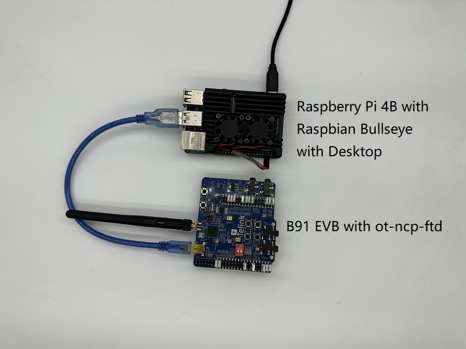

# 泰凌微电子Thread RCP和NCP方案介绍

## 介绍

[Thread规范](http://threadgroup.org/ThreadSpec)建立了一种可靠、安全且能效高的无线通信协议，适用于资源受限的设备，常见于智能家居和商业建筑。OpenThread包含了Thread的完整网络层范围，包括IPv6、6LoWPAN、带有MAC安全性的IEEE 802.15.4、网状链路建立和网状路由等功能。

Telink已将由谷歌的团队开发的OpenThread实现整合到Zephyr RTOS中，实现了与Telink硬件的无缝兼容。这个整合的源代码可以在[GitHub](https://github.com/telink-semi/zephyr)上方便地获取，并且还提供了软件开发工具包（SDK)。

在这个教程中，您将在Telink Zephyr开发环境上构建OpenThread NCP和RCP固件，使用这两种固件分别与树莓派协同工作，创建和管理Thread网络。其中，所需要的硬件，包括一个树莓派用作OT边界路由器并运行 `Pyspinel`，一个B91开发板用作OpenThread NCP，另一个B91开发板用作OpenThread RCP。

### 学习内容

* 使用Telink Zephyr开发环境配置OpenThread编译环境。

* 构建OpenThread Co-Processor固件（ `ot-ncp-ftd` 和 `ot-rcp` ），并分别将其烧录到Telink B91开发板。

* 在Raspberry Pi 3B+或更高版本上，使用Docker和RCP搭建OpenThread边界路由器（OTBR）。

* 在Raspberry Pi 3B+或更高版本上，使用 `Pyspinel` 验证NCP功能。

### 所需条件

硬件：

* 2块B91开发板。

* 1台Raspberry Pi 3B+或更高版本，并安装Raspbian操作系统映像。

* 1台Linux主机，至少带有两个USB端口。

* 1个已连接互联网的交换机（或路由器）和若干条以太网电缆。

软件：

* Telink烧录和调试工具 —— LinuxBDT。

* 其他工具，比如Git和West。

## 前提条件

### Thread基本概念和OpenThread Co-Processor

在进行本教程之前，建议先完成[OpenThread Simulation codelab](https://openthread.io/codelabs/openthread-simulation/#0)并阅读[OpenThread Co-Processor Designs](https://openthread.io/platforms/co-processor)，以便熟悉基本的Thread概念和OpenThread Co-Processor架构，对RCP和NCP两种设备有一个简单了解。

### Linux主机

Linux主机（Ubuntu v20.04 LTS或更高版本）充当构建机器，用于设置Telink Zephyr开发环境并烧录所有Thread开发板。为了完成这些任务，Linux主机需要两个可用的USB端口和互联网连接。

### Telink B91开发套件

本教程需要2块B91开发板。下面的图片展示了一个套件中所需的最少组件。


本教程将使用一块B91开发板作为RCP（无线电协处理器），使用另一个B91开发板作为NCP（网络协处理器）。
如果您尚未拥有这块开发板，您可以从[Telink官方网站](http://wiki.telink-semi.cn/wiki/Hardware/B91_Generic_Starter_Kit_Hardware_Guide/)获取有关B91开发套件的更多详细信息。
需要用到的部分组件如下表所示：

| 标号 | 名称                                                    |
| :--- | ------------------------------------------------------ |
| 1    | Telink B91开发板                                   |
| 2    | Telink烧录板                                            |
| 3    | 2.4GHz天线                                              |
| 4    | USB电缆（USB A 转 mini USB）                            |

### 安装有Raspbian操作系统镜像的树莓派3B+或更高版本

在本教程中，需要使用带有[Raspbian Bullseye Lite OS image](https://downloads.raspberrypi.org/raspios_lite_armhf/images/raspios_lite_armhf-2023-05-03/2023-05-03-raspios-bullseye-armhf-lite.img.xz) 或[Raspbian Bullseye with Desktop](https://downloads.raspberrypi.org/raspios_armhf/images/raspios_armhf-2023-05-03/2023-05-03-raspios-bullseye-armhf.img.xz)的树莓派3B+或更高版本。
它通过以太网连接到互联网，并将配置为OpenThread边界路由器（OTBR）的主机。

### 网络连接

本教程需要一个已连接互联网的交换机（或路由器）和若干条以太网电缆。
它们用于将Raspberry Pi与Linux主机连接起来，便于用户通过主机对Raspberry Pi进行配置。

### LinuxBDT

Telink [烧录和调试工具 (BDT)](http://wiki.telink-semi.cn/wiki/IDE-and-Tools/Burning-and-Debugging-Tools-for-all-Series/) 适用于所有Telink芯片系列，可用于擦除和烧录OpenThread固件到Telink B91开发套件上。
在您的Linux主机上安装基于X86架构的[LinuxBDT](http://wiki.telink-semi.cn/tools_and_sdk/Tools/BDT/LinuxBDT.tar.bz2)。

### 其他

* Git，用于设置Telink Zephyr开发环境。
* West， 用于管理Zephyr项目并构建OpenThread二进制文件。

## 固件设置

### Telink Zephyr开发环境设置

在Linux主机上打开命令行，执行以下命令，以确保您的APT软件包管理器是最新的。

```console
$ sudo apt update
$ sudo apt upgrade
```

完成后，继续执行以下步骤。

1. 安装依赖项。

```console
$ wget https://apt.kitware.com/kitware-archive.sh
$ sudo bash kitware-archive.sh
$ sudo apt install --no-install-recommends git cmake ninja-build gperf \
ccache dfu-util device-tree-compiler \
python3-dev python3-pip python3-setuptools python3-tk python3-wheel xz-utils file \
make gcc gcc-multilib g++-multilib libsdl2-dev
```

Zephyr目前需要主要依赖项的最低版本，例如 CMake (3.20.0)、Python3 (3.6)、Devicetree 编译器 (1.4.6)。

```console
$ cmake --version
$ python3 --version
$ dtc --version
```

在执行后续步骤之前，验证系统上安装的版本。如果版本不对，将 APT 镜像切换到稳定且最新的镜像，或手动更新这些依赖项。

2. 安装west。

```console
$ pip3 install --user -U west
$ echo 'export PATH=~/.local/bin:"$PATH"' >> ~/.bashrc
$ source ~/.bashrc
```

确保 `~/.local/bin` 包含在 `$PATH` 环境变量中。

3. 获取Zephyr项目的源码。

```console
$ west init ~/zephyrproject
$ cd ~/zephyrproject
$ west update
$ west blobs fetch hal_telink
$ west zephyr-export
```

在中国大陆，使用 `west init ~/zephyrproject` 和 `west update` 获取 Zephyr 源代码，通常需要花费额外的时间。此外，某些项目可能无法从国外服务器更新，寻找其他方法来下载最新的源代码。

4. 为 Zephyr 安装额外的 Python 依赖项。

```console
$ pip3 install --user -r ~/zephyrproject/zephyr/scripts/requirements.txt
```

5. 设置 Zephyr 工具链。下载 Zephyr 工具链（大约 1~2 GB）到本地目录中，以允许您烧录固件到开发板。在中国大陆境内，该步骤可能需要花费额外时间。

```console
$ wget https://github.com/zephyrproject-rtos/sdk-ng/releases/download/v0.16.1/zephyr-sdk-0.16.1_linux-x86_64.tar.xz
$ wget -O - https://github.com/zephyrproject-rtos/sdk-ng/releases/download/v0.16.1/sha256.sum | shasum --check --ignore-missing
```

下载Zephyr SDK并将其放置在推荐路径中，如下所示。

```console
$HOME/zephyr-sdk[-x.y.z]
$HOME/.local/zephyr-sdk[-x.y.z]
$HOME/.local/opt/zephyr-sdk[-x.y.z]
$HOME/bin/zephyr-sdk[-x.y.z]
/opt/zephyr-sdk[-x.y.z]
/usr/zephyr-sdk[-x.y.z]
/usr/local/zephyr-sdk[-x.y.z]
```

其中 [-x.y.z] 可以是任何文本的可选项，例如 -0.13.2。SDK安装后不能移动该目录。接着安装Zephyr工具链。

```console
$ tar xvf zephyr-sdk-0.16.1_linux-x86_64.tar.xz
$ cd zephyr-sdk-0.16.1
$ ./setup.sh -t riscv64-zephyr-elf -h -c
```

6. 构建Hello World示例。使用Hello World示例验证官方Zephyr项目配置是否正确，然后再继续设置自定义项目。

```console
$ cd ~/zephyrproject/zephyr
$ west build -p auto -b tlsr9518adk80d samples/hello_world
```

使用west build命令从Zephyr存储库的根目录构建hello_world示例。您可以在 `build/zephyr` 目录下找到名为 `zephyr.bin` 的固件。

7. 将Zephyr环境脚本添加到 `~/.bashrc`。在bash中执行一下命令。

```console
$ echo "source ~/zephyrproject/zephyr/zephyr-env.sh" >> ~/.bashrc
$ source ~/.bashrc
```

8. 添加Telink Zephyr远程库。下载Telink repo到本地作为开发分支并更新该分支。

```console
$ cd ~/zephyrproject/zephyr
$ git remote add telink-semi https://github.com/telink-semi/zephyr
$ git fetch telink develop
$ git checkout develop
$ cd ..
$ west update
$ west blobs fetch hal_telink
```

更多信息参考：[Zephyr Doc -- Getting Started Guide](https://docs.zephyrproject.org/latest/getting_started/index.html)

### 固件编译

本教程中将构建两种固件：

* `ot-ncp-ftd`
* `ot-rcp`

编译方法如下：

1. 无线电协处理器（ot-rcp）

```console
$ cd ~/zephyrproject
$ rm -rf build_ot_coprocessor
$ west build -b tlsr9518adk80d -d build_ot_coprocessor zephyr/samples/net/openthread/coprocessor -- -DDTC_OVERLAY_FILE="usb.overlay" -DOVERLAY_CONFIG=overlay-rcp-usb-telink.conf
```

2. 网络协处理器（ot-ncp-ftd）

打开位于 `zephyr/samples/net/openthread/coprocessor/overlay-rcp-usb-telink.conf` 文件，按如下示范进行修改。

```console
# Telink RCP USB-CDC-ACM

CONFIG_OPENTHREAD_COPROCESSOR_NCP=y
CONFIG_OPENTHREAD_COPROCESSOR_RCP=n
...
CONFIG_USB_DEVICE_PRODUCT="OpenThread CoProcessor NCP"
```

完成后打开位于 `zephyr/samples/net/openthread/coprocessor/boards/tlsr9518adk80d.conf` 文件，按如下示范进行修改。

```console
CONFIG_OPENTHREAD_NUM_MESSAGE_BUFFERS=256
```

然后执行以下命令编译 `ot-ncp-ftd` 固件。

```console
$ cd ~/zephyrproject
$ rm -rf build_ot_ncp_ftd
$ west build -b tlsr9518adk80d -d build_ot_ncp_ftd zephyr/samples/net/openthread/coprocessor -- -DDTC_OVERLAY_FILE="usb.overlay" -DOVERLAY_CONFIG=overlay-rcp-usb-telink.conf
```

### 泰凌LinuxBDT设置

下载Telink Linux BDT烧录工具，并将其解压到Linux主机的本地目录，例如 `~`，以允许用户将固件烧录到B91开发板。

```console
$ cd ~
$ wget http://wiki.telink-semi.cn/tools_and_sdk/Tools/BDT/LinuxBDT.tar.bz2
$ tar -vxf LinuxBDT.tar.bz2 
```

将BDT通过USB接口连接到Linux主机上，在命令行输入如下指令。

```console
$ cd LinuxBDT
$ sudo ./bdt lsusb -v
Bus 002 Device 001: ID 1d6b:0003 xHCI Host Controller
Bus 001 Device 003: ID 0bda:565a Integrated_Webcam_HD
Bus 001 Device 023: ID 413c:301a Dell MS116 USB Optical Mouse
Bus 001 Device 037: ID 248a:826a Telink Web Debugger v3.6
Bus 001 Device 001: ID 1d6b:0002 xHCI Host Controller
```

能搜索到Telink Web Debugger v3.6，代表BDT烧录器顺利连接到Linux主机。

### 固件烧录

如下图所示，使用USB连接线将一块Telink B91开发板连接到Telink烧录板。


在命令行输入如下指令（以烧录ot-ncp-ftd固件为例）。

```console
$ cd ~/zephyrproject/build_ot_ncp_ftd/zephyr
$ cp zephyr.bin ~/LinuxBDT/bin/ot-ncp-ftd.bin
$ cd ~/LinuxBDT
$ sudo ./bdt 9518 ac
 Activate OK!
$ sudo ./bdt 9518 wf 0 -i bin/ot-ncp-ftd.bin
 EraseSectorsize...
 Total Time: 2181 ms
 Flash writing...
 [100%][-] [##################################################]
 File Download to Flash at address 0x000000: 491700 bytes
 Total Time: 30087 ms
```

ot-rcp 的烧录方法和 ot-ncp-ftd 的基本一样，不同之处在于固件名称。烧录完成后分别将两块B91开发板做好标记区分，烧录 ot-ncp-ftd 的开发板标记为“NCP”，烧录 ot-rcp 的开发板标记为“RCP”。

## 固件应用

本教程使用树莓派来验证RCP和NCP两种固件功能

* 树莓派安装Docker作为OTBR的Host端，验证RCP功能。

* 树莓派安装并运行Pyspinel，验证NCP功能。

### 树莓派

1. 确保写入SD卡中的是[Raspbian Bullseye Lite OS image](https://downloads.Raspberrypi.org/raspios_lite_armhf/images/raspios_lite_armhf-2023-05-03/2023-05-03-raspios-bullseye-armhf-lite.img.xz)或[Raspbian Bullseye with Desktop](https://downloads.Raspberrypi.org/raspios_armhf/images/raspios_armhf-2023-05-03/2023-05-03-raspios-bullseye-armhf.img.xz)

2. 您可以选择通过SSH连接到树莓派，也可以直接在Raspbian桌面上操作。本教程将使用SSH。

3. 在下一步安装OTBR Docker或Pyspinel之前，先更新本地代码库和软件包管理器。

```console
$ sudo apt-get update
$ sudp apt-get upgrade
```

### 无线电协处理器（RCP）

ot-rcp固件的烧录步骤参考ot-ncp-ftd烧录过程，将B91开发板连接到树莓派的USB端口上，连接方式如下图所示。


#### 安装Docker

重新启动树莓派并打开一个SSH终端窗口。

1. 安装Docker：

```console
$ curl -sSL https://get.docker.com | sh
```

2. 将当前用户添加到Docker组中，授予权限，这样在每个命令前都不需要加上`sudo`。

```console
$ sudo usermod -aG docker $USER
```

     你需要重启树莓派来使改动生效。

3. 若Docker尚未启动，请将其启动：

```console
$ sudo dockerd
```

4. OTBR 防火墙脚本在 Docker 容器内创建规则。运行 modprobe 以加载 iptables 的内核模块。

```console
$ sudo modprobe ip6table_filter
```

#### 配置并运行Docker

本教程直接从[OpenThread Docker Hub](https://hub.docker.com/u/openthread/)拉取OTBR Docker镜像，该镜像已经过OpenThread团队的测试和验证。

1. 拉取镜像：

```console
$ docker pull openthread/otbr:latest
```

2. 查看Docker容器中的镜像列表：

```console
$ docker images
REPOSITORY        TAG       IMAGE ID       CREATED      SIZE
openthread/otbr   latest    db081f4de15f   6 days ago   766MB
```

3. 通过检查 `/dev` 确定RCP设备的串行端口名称, 出现 `ttyACM0` 表示RCP正确连接。

```console
$ ls /dev/tty*
...
/dev/ttyACM0
... 
```

4. 第一次运行OTBR Docker, 并引用RCP的串行端口（ttyACM0），此后若要继续使用该OTBR Docker，请使用命令 **docker start otbr**。

```console
$ docker run --name "otbr" --sysctl "net.ipv6.conf.all.disable_ipv6=0 net.ipv4.conf.all.forwarding=1 net.ipv6.conf.all.forwarding=1" -p 8080:80 --dns=127.0.0.1 -it --volume /dev/ttyACM0:/dev/ttyACM0 --privileged openthread/otbr --radio-url spinel+hdlc+uart:///dev/ttyACM0
```

5. 新开一个SSH终端窗口，测试树莓派和RCP的连通性，并建立Thread网络。

```console
$ docker exec -ti otbr sh -c "sudo ot-ctl"
> state 
disabled
Done
> panid 0x1022 
Done
> ifconfig up
Done
> thread start 
Done
> state 
detached
Done
> state 
leader
Done
```

可选用的Docker命令：

* 获取正在运行的Docker容器信息：

```console
$ docker ps -aq
```

* 停止OTBR Docker：

```console
$ docker stop otbr
```

* 移除OTBR Docker：

```console
$ docker rm otbr
```

* 重新加载OTBR Docker：

```console
$ docker restart otbr
```

### 网络协处理器（NCP）

关闭树莓派，拔掉RCP。将NCP连接到树莓派的USB端口上，再重新启动树莓派。连接方式如下图。



#### 安装Pyspinel

在树莓派上打开一个新的SSH终端窗口。

1. 安装依赖项：

```console
$ sudo apt install python3-pip
$ pip3 install --user pyserial ipaddress
```

2. 下载 `pyspinel` 的源码到本地：

```console
$ git clone https://github.com/openthread/pyspinel
```

3. 安装Pyspinel：

```console
$ cd pyspinel
$ sudo python3 setup.py install
```

#### 验证NCP功能

1. 配置NCP连接。

```console
$ sudo chmod a+rw /dev/ttyACM0
```

2. 运行Pyspinel CLI。

```console
$ spinel-cli.py -u /dev/ttyACM0 -n 1
spinel-cli >
```

3. 查询NCP版本。

```console
spinel-cli > version
OPENTHREAD/aabbee49c; Zephyr; Aug 10 2023 14:02:37
Done
```

4. 建立Thread网络。

```console
spinel-cli > ifconfig up
Done
spinel-cli > thread start
Done
spinel-cli > state
detached
Done
spinel-cli > state
leader
Done
```

可以看到NCP已成为leader，Thread网络被成功创建。

可选用的spinel-cli命令：

* 查看帮助菜单获取可用命令。

```console
spinel-cli > help

Available commands (type help <name> for more information):
============================================================
bufferinfo         extaddr       ncp-filter        releaserouterid
channel            extpanid      ncp-ll64          reset
child              h             ncp-ml64          rloc16
childmax           help          ncp-raw           route
childtimeout       history       ncp-tun           router
clear              ifconfig      netdata           routerdowngradethreshold
commissioner       ipaddr        networkidtimeout  routerselectionjitter
contextreusedelay  joiner        networkkey        routerupgradethreshold
counters           keysequence   networkname       scan
debug              leaderdata    panid             state
debug-mem          leaderweight  parent            thread
diag               mac           ping              txpower
discover           macfilter     prefix            v
eidcache           mfg           q                 vendor
exit               mode          quit              version
```

## 总结

您现在已经知道：

* 如何搭建并使用Telink Zephyr开发环境。
* 如何构建 `ot-ncp-ftd` 和 `ot-rcp` 两种二进制文件并将其烧录到B91开发板。
* 如何使用Docker和RCP将Raspberry Pi 3B+ 或更高版本设置为OpenThread边界路由器（OTBR）。
* 在Raspberry Pi 3B+或更高版本上，使用 `Pyspinel` 验证NCP功能。

RCP和NCP方案都可以实现OTBR的功能，从目前的社区的支持力度看，RCP更适合用于OTBR的开发。

### 深入阅读

查看[openthread.io](https://openthread.io/)和[GitHub](https://github.com/openthread)，了解各种OpenThread资源，包括：

* [Supported Platforms](https://openthread.io/platforms/)
    — discover all the platforms that support OpenThread
* [Build OpenThread](../../guides/build/index.md)
    — further details on building and configuring OpenThread
* [Thread Primer](../../guides/thread-primer/index.md)
    — covers all the Thread concepts featured in this codelab

参考文档:

* [OpenThread Co-Processor Designs](https://openthread.io/platforms/co-processor)
* [OpenThread Pyspinel](https://openthread.io/guides/pyspinel)
* [OpenThread Border Router](https://openthread.io/guides/border-router)
