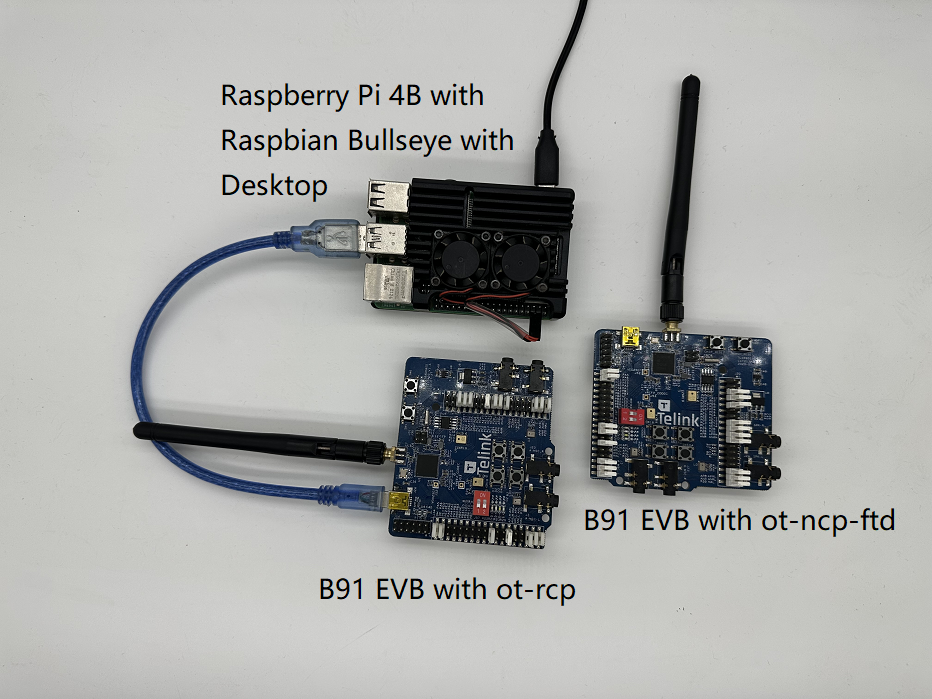
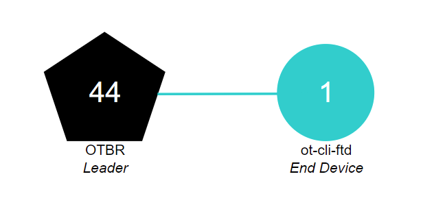

# Building a Thread Network with the TLSR9518 Development Kit and OpenThread

[Codelab Feedback](https://github.com/openthread/ot-docs/issues)

## Introduction


[OpenThread](https://openthread.io/), released by Google, is an open-source implementation of the [Thread®](http://threadgroup.org/) network protocol. Google Nest provides OpenThread to developers to promote the development of connected home products by providing access to the technology used in Nest products.

The [Thread Specification](http://threadgroup.org/ThreadSpec) establishes a reliable, secure, and energy-efficient wireless communication protocol for home applications, leveraging IPv6. OpenThread includes the full network layer scope within Thread, such as IPv6, 6LoWPAN, IEEE 802.15.4 with MAC security, mesh link establishment, and mesh routing.

In this Codelab, you will program OpenThread on actual hardware, create and manage a Thread network, and exchange messages between nodes.



### What you'll learn

* How to set up and use the Telink Zephyr development environment
* How to build the ot-cli-ftd and ot-rcp binary files and flash them onto the TLSR9518 development kit
* How to set up a Raspberry Pi 3B+ or later as an OpenThread Border Router (OTBR) using Docker
* How to create a Thread network on the OTBR
* How to add devices to the Thread network using out-of-band debugging
* How to validate the connectivity between nodes in the Thread network using CLI

## What you'll need

### Hardware:

1. Two TLSR9518 development kits. This Codelab uses one as RCP and the other as FTD. If you are new to this board, you can obtain the TLSR9518 development kit from the [Telink official website](http://wiki.telink-semi.cn/wiki/Hardware/B91_Generic_Starter_Kit_Hardware_Guide/), as shown below.

     

     | Index | Name                                                    |
     | :--- | -------------------------------------------------------- |
     | 1    | Telink TLSR9518 Development Kit                       |
     | 2    | Telink Burning Kit                                   |
     | 3    | 2.4Ghz Antenna                                          |
     | 4&5  | USB Cable (USB A to mini USB)                           |
     | 6    | USB to TTL Serial Cable                     |

2. Raspberry Pi 3B+ or later, able to connect to the internet via Ethernet. In this Codelab, it will be configured as the host for the OpenThread Border Router.

3. A Linux host system with a Debian-based distribution (such as Ubuntu v20.04 LTS or later), to be used as the build machine. The Linux host requires two USB ports and internet connectivity.

4. An internet-connected switch and several Ethernet cables, to connect the Raspberry Pi and the Linux host to the switch, facilitating user configuration of the Raspberry Pi via the host.

### Software:

1. Telink's LinuxBDT tool, for erasing and flashing firmware。

2. Serial port terminal (such as YAT), used in this Codelab for controlling ot-cli-ftd. Please familiarize yourself with the basic concepts of Thread and OpenThread CLI before use.

3. SSH terminal (such as MobaXterm), used in this Codelab for the user to control the Raspberry Pi through。

## Firmware Setup

### Setting up the Telink Zephyr Development Environment

Please first execute APT updates and upgrades, then proceed with the steps below.

```console
$ sudo apt update
$ sudo apt upgrade
```

1. Install the dependencies：

     ```console
     $ wget https://apt.kitware.com/kitware-archive.sh
     $ sudo bash kitware-archive.sh
     $ sudo apt install --no-install-recommends git cmake ninja-build gperf \
     ccache dfu-util device-tree-compiler \
     python3-dev python3-pip python3-setuptools python3-tk python3-wheel xz-utils file \
     make gcc gcc-multilib g++-multilib libsdl2-dev
     ```

     Zephyr currently requires minimum versions of main dependencies, such as CMake (3.20.0), Python3 (3.6), and Devicetree Compiler (1.4.6).

     ```console
     $ cmake --version
     $ python3 --version
     $ dtc --version
     ```

     Verify the installed versions on your system before proceeding with the next steps. If the versions are not correct, switch the APT mirror to a stable and up-to-date mirror, or manually update these dependencies.

2. Install west：

     ```console
     $ pip3 install --user -U west
     $ echo 'export PATH=~/.local/bin:"$PATH"' >> ~/.bashrc
     $ source ~/.bashrc
     ```

     Make sure that ~/.local/bin is in your $PATH environment variable.

3. Get the Telink Zephyr source code：

     ```console
     $ west init ~/zephyrproject
     $ cd ~/zephyrproject
     $ west update
     $ west blobs fetch hal_telink
     $ west zephyr-export
     ```

     In mainland China, using west init ~/zephyrproject and west update to get Zephyr source code usually takes extra time. In addition, some projects might not update from foreign servers. Please find alternative methods to download the latest source code.

4. Install additional Python dependencies for Zephyr：

     ```console
     $ pip3 install --user -r ~/zephyrproject/zephyr/scripts/requirements.txt
     ```

5. Set up the Zephyr toolchain：

     Download the Zephyr toolchain (about 1~2 GB) to a local directory to allow you to flash most boards. It may take extra time within mainland China.

     ```console
     $ wget https://github.com/zephyrproject-rtos/sdk-ng/releases/download/v0.16.1/zephyr-sdk-0.16.1_linux-x86_64.tar.xz
     $ wget -O - https://github.com/zephyrproject-rtos/sdk-ng/releases/download/v0.16.1/sha256.sum | shasum --check --ignore-missing
     ```
     Download the Zephyr SDK and place it in the recommended path, as shown below.

     ```console
     $HOME/zephyr-sdk[-x.y.z]
     $HOME/.local/zephyr-sdk[-x.y.z]
     $HOME/.local/opt/zephyr-sdk[-x.y.z]
     $HOME/bin/zephyr-sdk[-x.y.z]
     /opt/zephyr-sdk[-x.y.z]
     /usr/zephyr-sdk[-x.y.z]
     /usr/local/zephyr-sdk[-x.y.z]
     ```

     Where [-xyz] is optional text that can be any text, such as -0.16.1. The directory cannot be moved after the SDK is installed。 Then install the Zephyr toolchain：

     ```console
     $ tar xvf zephyr-sdk-0.16.1_linux-x86_64.tar.xz
     $ cd zephyr-sdk-0.16.1
     $ ./setup.sh -t riscv64-zephyr-elf -h -c
     ```

6. Build the Hello World example

     First, verify that the official Zephyr project configuration is correct using the Hello World example, then proceed with setting up your custom project.

     ```console
     $ cd ~/zephyrproject/zephyr
     $ west build -p auto -b tlsr9518adk80d samples/hello_world
     ```

     Use the west build command to build the hello_world example from the root directory of the Zephyr repository. You can find the firmware named zephyr.bin under the build/zephyr directory.

7. Add the Zephyr environment script to ~/.bashrc

     Execute the following commands in bash：

     ```console
     $ echo "source ~/zephyrproject/zephyr/zephyr-env.sh" >> ~/.bashrc
     $ source ~/.bashrc
     ```

8. Add the Telink Zephyr remote repository：

     Download the Telink repo locally as a development branch and update it。

     ```console
     $ cd ~/zephyrproject/zephyr
     $ git remote add telink-semi https://github.com/telink-semi/zephyr
     $ git fetch telink develop
     $ git checkout develop
     $ cd ..
     $ west update
     $ west blobs fetch hal_telink
     ```

     For more information, refer to：[https://docs.zephyrproject.org/latest/getting_started/index.html](https://docs.zephyrproject.org/latest/getting_started/index.html)

### Setting up Telink Tools

Download the Telink Linux BDT flashing tool and extract it to a local directory on your Linux host, such as ~, to allow users to flash firmware onto the TLSR9518 development kit.

```console
$ cd ~
$ wget http://wiki.telink-semi.cn/tools_and_sdk/Tools/BDT/LinuxBDT.tar.bz2
$ tar -vxf LinuxBDT.tar.bz2 
```
> aside positive
>
> **Note:** Downloading may take extra time outside mainland China。

Connect the Burning Kit to the Linux host via the USB interface and enter the following command in the SSH command line.。

```console
$ cd LinuxBDT
$ sudo ./bdt lsusb -v
Bus 002 Device 001: ID 1d6b:0003 xHCI Host Controller
Bus 001 Device 003: ID 0bda:565a Integrated_Webcam_HD
Bus 001 Device 023: ID 413c:301a Dell MS116 USB Optical Mouse
Bus 001 Device 037: ID 248a:826a Telink Web Debugger v3.6
Bus 001 Device 001: ID 1d6b:0002 xHCI Host Controller
```

If you see the message "Telink Web Debugger v3.6", it means that the BDT programmer is successfully connected to Linux, and you can proceed to the next step of firmware flashing.

### Firmware Compilation

This Codelab will use two types of firmware, ot-cli-ftd and ot-rcp. The compilation methods are as follows：

1. Radio Co-Processor（ot-rcp)

     ```console
     $ cd ~/zephyrproject
     $ rm -rf build_ot_coprocessor
     $ west build -b tlsr9518adk80d -d build_ot_coprocessor zephyr/samples/net/openthread/coprocessor -- -DDTC_OVERLAY_FILE="usb.overlay" -DOVERLAY_CONFIG=overlay-rcp-usb-telink.conf
     ```

2. Full-Featured Thread Device with Interactive Command Line (ot-cli-ftd)

     ```console
     $ cd ~/zephyrproject
     $ rm -rf build_ot_cli_ftd
     $ west build -b tlsr9518adk80d -d build_ot_cli_ftd zephyr/samples/net/openthread/cli -- -DOVERLAY_CONFIG=overlay-telink-fixed-mac.conf -DCONFIG_OPENTHREAD_FTD=y
     ```

### Firmware Flashing

Connect the TLSR9518 development kit to the Burning Kit as shown in the figure below


Enter the following command in the SSH command line (taking the flashing of the ot-cli-ftd firmware as an example).

```console
$ cd ~/zephyrproject/build_ot_cli_ftd/zephyr
$ cp zephyr.bin ~/LinuxBDT/bin/ot-cli-ftd.bin
$ cd ~/LinuxBDT
$ sudo ./bdt 9518 ac
 Activate OK!
$ sudo ./bdt 9518 wf 0 -i bin/ot-cli-ftd.bin
 EraseSectorsize...
 Total Time: 2181 ms
 Flash writing...
 [100%][-] [##################################################]
 File Download to Flash at address 0x000000: 491700 bytes
 Total Time: 30087 ms
```

The flashing method for ot-rcp is basically the same as ot-cli-ftd, the difference is in the firmware name. After flashing is completed, mark the two TLSR9518 development kits separately for distinction.

## Configuring a Serial Console for the ot-cli-ftd Device

To control the FTD device through the command line function, connect the UART to the following pins：

| Name  | Pin                                                    |
| :---- | ------------------------------------------------------ |
| RX    | PB3 (pin 15 of J34)                                    |
| TX    | PB2 (pin 18 of J34)                                    |
| GND   | GND (pin 23 of J50)                                    |

> aside positive
>
> **Note:** Baud rate：115200 bits/s

After connecting the device as shown in the figure, open the YAT software, create a new terminal, set the serial port information, and open the serial port.


 The OpenThread command line reference is [OpenThread CLI Reference](https://github.com/openthread/openthread/blob/f7690fe7e9d638341921808cba6a3e695ec0131e/src/cli/README.md). Be sure to prefix with `ot` when using it.

Example：
```bash
> ot state
disabled
Done
> ot channel
17
Done
>
```

## Setting up OpenThread Border Router (OTBR)

An OpenThread Border Router is a device consisting of two main parts：
* **Raspberry Pi** contains all the services and firmware required to act as a Border Router (BR).
* **RCP **is responsible for Thread communication.

### Radio Co-Processor（RCP）

For the flashing steps of the ot-rcp firmware, refer to the flashing process of ot-cli-ftd. Connect the TLSR9518 development kit to a USB port of the Raspberry Pi. The connection is as shown in the figure.


### Raspberry Pi

1. Make sure that the [Raspbian Bullseye Lite OS image](https://downloads.raspberrypi.org/raspios_lite_armhf/images/raspios_lite_armhf-2023-05-03/2023-05-03-raspios-bullseye-armhf-lite.img.xz) or [Raspbian Bullseye with Desktop](https://downloads.raspberrypi.org/raspios_armhf/images/raspios_armhf-2023-05-03/2023-05-03-raspios-bullseye-armhf.img.xz) is written to the SD card.
2. Users can connect to Raspberry Pi via SSH.
3. Before installing OTBR Docker in the next step, update the local code library and package manager first.

     ```console
     $ sudo apt-get update
     $ sudp apt-get upgrade
     ```

### Install Docker

Restart Raspberry Pi and open a terminal window.

1. Install Docker

     ```console
     $ curl -sSL https://get.docker.com | sh
     ```

2. Modify Docker user settings, so that sudo does not need to be added in front of each command. You need to restart after this.

     ```console
     $ sudo usermod -aG docker $USER
     ```

3. Install git

     ```console
     $ sudo apt install git
     ```

4. If Docker has not started, start it

     ```console
     $ sudo dockerd
     ```

5. The OTBR firewall script creates rules within the Docker container. Run modprobe to load the kernel module of iptables.

     ```console
     $ sudo modprobe ip6table_filter
     ```

### Configure and Run Docker

This Codelab pulls the OTBR Docker image directly from the [OpenThread Docker Hub](https://hub.docker.com/u/openthread/). This image has been tested and verified by the OpenThread team.

1. Pull the image

     ```console
     $ docker pull openthread/otbr:latest
     ```

2. View the image list in the Docker container

     ```console
     $ docker images
     REPOSITORY        TAG       IMAGE ID       CREATED      SIZE
     openthread/otbr   latest    db081f4de15f   6 days ago   766MB
     ```

3. Determine the serial port name of the RCP device by checking /dev, ttyACM0 indicates that the RCP is correctly connected

     ```console
     $ ls /dev/tty*
     ...
     /dev/ttyACM0
     ... 
     ```

4. Run OTBR Docker for the first time, and reference the serial port of RCP (ttyACM0). If you want to continue using this OTBR Docker, use the command **docker start otbr**

     ```console
     $ docker run --name "otbr" --sysctl "net.ipv6.conf.all.disable_ipv6=0 net.ipv4.conf.all.forwarding=1 net.ipv6.conf.all.forwarding=1" -p 8080:80 --dns=127.0.0.1 -it --volume /dev/ttyACM0:/dev/ttyACM0 --privileged openthread/otbr --radio-url spinel+hdlc+uart:///dev/ttyACM0
     ```

5. Open a new terminal window to test the connectivity between the Raspberry Pi and the RCP

     ```console
     $ docker exec -ti otbr sh -c "sudo ot-ctl"
     > state 
     disabled
     Done
     ```

Optional
* Get information about the running Docker container

     ```console
     $ docker ps -aq
     ```

* Stop OTBR Docker

     ```console
     $ docker stop otbr
     ```

* Remove OTBR Docker

     ```console
     $ docker rm otbr
     ```

* Reload OTBR Docker

     ```console
     $ docker restart otbr
     ```

At this point, a FTD device and an OTBR are ready, and you can proceed to the next step to build the Thread network.

## Create a Thread Network

### Create a Thread Network with OTBR

We use the **ot-ctl** shell of OTBR to establish a Thread network. Enter the following in the SSH terminal:

```console
$ docker exec -ti otbr sh -c "sudo ot-ctl"
```

Then enter the commands in the order of the table, and make sure that each step achieves the expected result before proceeding to the next step.

| Index | Command               |Simple introduction                                                           | Expected Responses |
| :---- | --------------------- | ---------------------------------------------------------------------------- | ------------------ |
| 1     | dataset init new      | Create a new random network dataset                                          | Done               |
| 2     | dataset commit active | Commit new dataset to the Active Operational Dataset in non-volatile storage | Done               |
| 3     | ifconfig up           | Bring up the IPv6 interface                                                  | Done               |
| 4     | thread start          | Enable Thread protocol operation and attach to a Thread network              | Done               |
| 5     | state                 | Check the device state.This command can be called multiple times until it becomes the leader and moves on to the next step                                                    | leader<br/>Done               |
| 6     | dataset active        | Check the complete Active Operational Dataset, please remember networkkey                                                  | Active Timestamp: 1<br/>Channel: 13<br/>Channel Mask: 0x07fff800<br/>Ext PAN ID: b07476e168eda4fc<br/>Mesh Local Prefix: fd8c:60bc:a98:c7ba::/64<br/>Network Key: c312485187484ceb5992d2343baaf93d<br/>Network Name: OpenThread-599c<br/>PAN ID: 0x599c<br/>PSKc: 04f79ad752e8401a1933486c95299f60<br/>Security Policy: 672 onrc 0<br/>Done               |

The network key randomly generated by OTBR during network creation will be used when other devices join this Thread network.
### The ot-cli-ftd joins the network through out-of-band commissioning

Out-of-band commissioning refers to the transmission of network credentials to devices waiting to join the network through non-wireless methods (for example, manually entering in the OpenThread CLI). Enter the following commands in order in the serial console to the ot-cli-ftd.

| Index | Command                                                  |Simple introduction                                                            | Expected Responses |
| :---- | -------------------------------------------------------- | ----------------------------------------------------------------------------- | ------------------ |
| 1     | ot dataset networkkey c312485187484ceb5992d2343baaf93d   | Only the Network Key is necessary for a device to connect to a Thread network | Done               |
| 2     | ot dataset commit active                                 | Commit new dataset to the Active Operational Dataset in non-volatile storage  | Done               |
| 3     | ot ifconfig up                                           | Bring up the IPv6 interface                                                   | Done               |
| 4     | ot thread start                                          | Enable Thread protocol operation and attach to a Thread network               | Done               |
| 5     | ot state                                                 | Check the device state                                                        | child/router<br/>Done               |

> aside positive
>
> **Note:** The ot-cli-ftd device starts as a child and will turn into a router after a while, which is normal.
### Topology

Enter commands such as `ipaddr`, `child table`, `router table` in the SSH terminal to get responses like the figure.

```console
> ipaddr rloc
fd8c:60bc:a98:c7ba:0:ff:fe00:b000
Done
> child table
| ID  | RLOC16 | Timeout    | Age        | LQ In | C_VN |R|D|N|Ver|CSL|QMsgCnt|Suprvsn| Extended MAC     |
+-----+--------+------------+------------+-------+------+-+-+-+---+---+-------+-------+------------------+
|   1 | 0xb001 |        240 |         23 |     3 |   51 |1|1|1|  3| 0 |     0 |   129 | 82bc12fbe783468e |

Done
> router table
| ID | RLOC16 | Next Hop | Path Cost | LQ In | LQ Out | Age | Extended MAC     | Link |
+----+--------+----------+-----------+-------+--------+-----+------------------+------+
| 44 | 0xb000 |       63 |         0 |     0 |      0 |   0 | 7ae354109d611f7e |    0 |

Done
...
> child table
| ID  | RLOC16 | Timeout    | Age        | LQ In | C_VN |R|D|N|Ver|CSL|QMsgCnt|Suprvsn| Extended MAC     |
+-----+--------+------------+------------+-------+------+-+-+-+---+---+-------+-------+------------------+

Done
> router table
| ID | RLOC16 | Next Hop | Path Cost | LQ In | LQ Out | Age | Extended MAC     | Link |
+----+--------+----------+-----------+-------+--------+-----+------------------+------+
| 33 | 0x8400 |       63 |         0 |     3 |      3 |  13 | e61487c1cda940a6 |    1 |
| 44 | 0xb000 |       63 |         0 |     0 |      0 |   0 | 7ae354109d611f7e |    0 |

Done
```

The RLOC16 of OTBR is 0xb000, the RLOC16 of the ot-cli-ftd device initially is 0xb001, and it becomes 0x8400 after obtaining the Router ID. It can be seen that the ot-cli-ftd device has been upgraded from a child to a router.

> aside positive
>
> **Note:** RLOC stands for Routing Locator, which identifies the device based on the position of the Thread device in the network topology. It is one of the several IPv6 addresses of the Thread device. For a detailed introduction, refer to [IPv6 Addressing](https://openthread.io/guides/thread-primer/ipv6-addressing#routing-locator-rloc)

The current Thread network contains two nodes, and the topology is as shown in the figure below.



## Communication Between Thread Devices

### ICMPv6 Communication

We use the `ping` command to check whether Thread devices in the same network can communicate with each other. First, use the `ipaddr` command to get the RLOC of the device.

```console
> ipaddr
fd8c:60bc:a98:c7ba:0:ff:fe00:fc11
fdbd:7274:649c:1:1d19:9613:f705:a5af
fd8c:60bc:a98:c7ba:0:ff:fe00:fc10
fd8c:60bc:a98:c7ba:0:ff:fe00:fc38
fd8c:60bc:a98:c7ba:0:ff:fe00:fc00
fd8c:60bc:a98:c7ba:0:ff:fe00:b000
fd8c:60bc:a98:c7ba:5249:34ab:26d1:aff6
fe80:0:0:0:78e3:5410:9d61:1f7e
Done
```

Enter the following command in the serial console of the ot-cli-ftd device to execute the ping operation.

```console
> ot ping fd8c:60bc:a98:c7ba:0:ff:fe00:b000
16 bytes from fd8c:60bc:a98:c7ba:0:ff:fe00:b000: icmp_seq=1 hlim=64 time=19ms
1 packets transmitted, 1 packets received. Packet loss = 0.0%. Round-trip min/avg/max = 19/19.0/19 ms.
Done
```

The output response of the serial port indicates that the OTBR side has received the ping request, and the ot-cli-ftd device has received the ping response returned by OTBR. The communication between the two devices is normal.

### UDP Communication

The application services provided by OpenThread also include UDP. You can use the UDP API to pass information between nodes in the Thread network, or pass information to external networks through the Border Router. The detailed introduction of OpenThread's UDP API is in the [OpenThread CLI - UDP Example](https://github.com/openthread/openthread/blob/f7690fe7e9d638341921808cba6a3e695ec0131e/src/cli/README_UDP.md). This Codelab will use some of the APIs in it to transmit information between OTBR and ot-cli-ftd.

First, get the Mesh-Local EID of OTBR. This address is also one of the IPv6 addresses of the Thread device, and it can be used to access Thread devices in the same Thread network partition.

```console
> ipaddr mleid
fd8c:60bc:a98:c7ba:5249:34ab:26d1:aff6
Done
```

Enter the following command in the SSH terminal to enable OTBR UDP and bind the device's 1022 port.

```console
> udp open
Done
> udp bind :: 1022
Done
```

Enter the following command in the serial console, enable the UDP of the ot-cli-ftd device, bind the device's 1022 port, and then send a 5-byte `hello` message to OTBR.

```console
> ot udp open 
Done
> ot udp bind :: 1022
Done
> ot udp send fd8c:60bc:a98:c7ba:5249:34ab:26d1:aff6 1022 hello
Done
```

The SSH terminal outputs the following information. OTBR receives the `hello` message from the ot-cli-ftd device, and the UDP communication is successful.

```console
> 5 bytes from fd8c:60bc:a98:c7ba:9386:63cf:19d7:5a61 1022 hello
```

## Congratulations

A simple Thread network has been created, and the communication function of the network has been verified.

You now know:

* How to build and use the Telink Zephyr development environment
* How to build the ot-cli-ftd and ot-rcp binaries and flash them to the TLSR9518 development kit
* How to set up a Raspberry Pi 3B+ or higher version as an OpenThread Border Router (OTBR) using Docker
* How to create a Thread network on OTBR.
* Add devices to the Thread network through out-of-band commissioning
* How to verify the connectivity between nodes in the Thread network

### Further Reading

Check out [openthread.io](https://openthread.io/) and [GitHub](https://github.com/openthread) to learn about various OpenThread resources, including:

*  [Supported Platforms](https://openthread.io/platforms/)
    — discover all the platforms that support OpenThread
*  [Build OpenThread](../../guides/build/index.md)
    — further details on building and configuring OpenThread
*  [Thread Primer](../../guides/thread-primer/index.md)
    — covers all the Thread concepts featured in this Codelab

Reference documents:

*  [OpenThread CLI reference](https://github.com/openthread/openthread/blob/main/src/cli/README.md)
*  [OpenThread UDP CLI reference](https://github.com/openthread/openthread/blob/main/src/cli/README_UDP.md)
*  [OpenThread Daemon reference](https://openthread.io/platforms/co-processor/ot-daemon)
*  [OpenThread UDP API reference](https://openthread.io/reference/group/api-udp)
*  [GNU Screen quick reference](http://aperiodic.net/screen/quick_reference)

## License

Copyright (c) 2021-2022, The OpenThread Authors.
All rights reserved.

Redistribution and use in source and binary forms, with or without
modification, are permitted provided that the following conditions are met:

1. Redistributions of source code must retain the above copyright
   notice, this list of conditions and the following disclaimer.
2. Redistributions in binary form must reproduce the above copyright
   notice, this list of conditions and the following disclaimer in the
   documentation and/or other materials provided with the distribution.
3. Neither the name of the copyright holder nor the
   names of its contributors may be used to endorse or promote products
   derived from this software without specific prior written permission.

THIS SOFTWARE IS PROVIDED BY THE COPYRIGHT HOLDERS AND CONTRIBUTORS "AS IS"
AND ANY EXPRESS OR IMPLIED WARRANTIES, INCLUDING, BUT NOT LIMITED TO, THE
IMPLIED WARRANTIES OF MERCHANTABILITY AND FITNESS FOR A PARTICULAR PURPOSE
ARE DISCLAIMED. IN NO EVENT SHALL THE COPYRIGHT HOLDER OR CONTRIBUTORS BE
LIABLE FOR ANY DIRECT, INDIRECT, INCIDENTAL, SPECIAL, EXEMPLARY, OR
CONSEQUENTIAL DAMAGES (INCLUDING, BUT NOT LIMITED TO, PROCUREMENT OF
SUBSTITUTE GOODS OR SERVICES; LOSS OF USE, DATA, OR PROFITS; OR BUSINESS
INTERRUPTION) HOWEVER CAUSED AND ON ANY THEORY OF LIABILITY, WHETHER IN
CONTRACT, STRICT LIABILITY, OR TORT (INCLUDING NEGLIGENCE OR OTHERWISE)
ARISING IN ANY WAY OUT OF THE USE OF THIS SOFTWARE, EVEN IF ADVISED OF THE
POSSIBILITY OF SUCH DAMAGE.

